# **Lab 8 – How a Neural Network Learns**

## **Objective**
To simulate how a neural network learns to make decisions using weights and feedback, and to understand how pattern recognition and learning from mistakes work.

---

## **Setup**

### **Neural Network Diagram**

**Description:**
- **Input Layer:** Food, Service, Price  
- **Hidden Layer:** Decision Node  
- **Output Layer:** Like / Dislike  

---

## **Part A: Training Phase**

### **Step 1: Initial Weights**

| Feature | Tokens (Weight) |
|----------|-----------------|
| Food | 🍗 |
| Service | 🍽️ |
| Price | 💰 |

---

### **Step 2: Process 10 Training Scenarios**

| Card | Food | Service | Price | Actual | Prediction | Correct? | Weight Adjustment |
|------|-------|----------|--------|----------|-------------|-----------|-------------------|
| 1 | Great | Poor | Cheap | LIKE | LIKE | Yes | No change |
| 2 | Bad | Great | Expensive | DISLIKE | LIKE | No | +1 on Food, -1 on Service |
| 3 | Good | Okay | Moderate | LIKE | LIKE | Yes | No change |
| 4 | Poor | Poor | Cheap | DISLIKE | DISLIKE | Yes | No change |
| 5 | Excellent | Excellent | Expensive | LIKE | LIKE | Yes | +1 on Food |
| 6 | Okay | Bad | Moderate | DISLIKE | DISLIKE | Yes | No change |
| 7 | Great | Okay | Cheap | LIKE | LIKE | Yes | No change |
| 8 | Poor | Excellent | Expensive | DISLIKE | LIKE | No | +1 on Food, -1 on Service |
| 9 | Excellent | Poor | Moderate | LIKE | LIKE | Yes | No change |
| 10 | Okay | Okay | Expensive | DISLIKE | DISLIKE | Yes | No change |

**Training Accuracy:** 8/10 (80%)

---

### **Step 3: Final Weights After Training**

| Feature | Tokens (Weight) | Meaning |
|----------|-----------------|----------|
| Food | 🍗🍗🍗🍗 | Most important factor — good food strongly predicts “Like” |
| Service | 🍽️ | Least important — sometimes misleading |
| Price | 💰 | Moderately important — cheap or moderate prices slightly preferred |

```mermaid
graph TD
    subgraph Final_Weights
        F(Food: 🔴🔴🔴🔴)
        S(Service: 🔵)
        P(Price: 🟢🟢)
    end
    F --> Decision
    S --> Decision
    P --> Decision
    Decision(Decision Node) --> Output{Like / Dislike}
```

---

## **Part B: Testing Phase**

| Card | Food | Service | Price | Actual | Prediction (using weights) | Correct? |
|------|-------|----------|--------|----------|------------------------------|-----------|
| 11 | Good | Excellent | Cheap | LIKE | LIKE (good food, cheap) | Yes |
| 12 | Bad | Bad | Expensive | DISLIKE | DISLIKE (bad food, high price) | Yes |
| 13 | Excellent | Great | Moderate | LIKE | LIKE (excellent food dominates) | Yes |

**Testing Accuracy:** 3/3 (100%)

---

## **Reflection Discussion**

### **1. How did your predictions improve?**
At the start, predictions were random since all features had equal importance. As training progressed, the team noticed that **Food quality** was the strongest indicator of “Like” while **Service** sometimes misled the model. After adjusting weights, accuracy improved from around 60% early on to 80%+.

### **2. How did “weights” help you learn?**
Weights acted as memory — they told us which features mattered most in past correct decisions. By increasing weights for important inputs (Food) and reducing for less helpful ones (Service), the model learned to focus on the right signals.

### **3. What would happen with more layers or inputs?**
Adding more layers would allow the model to recognize more complex patterns — for example, combining “Food” and “Price” to detect “good value.” More inputs (like atmosphere or location) would improve accuracy but require more training data.

### **4. How does this reflect how real AI works?**
Real neural networks adjust their **numerical weights** automatically through **backpropagation** — increasing or decreasing them based on how wrong they were. Just like we added tokens, AI adjusts numbers to minimize error and improve predictions over time.

---

**Final Summary:**
- **Training Accuracy:** 80%
- **Testing Accuracy:** 100%
- **Learned Importance:** Food > Price > Service

---
