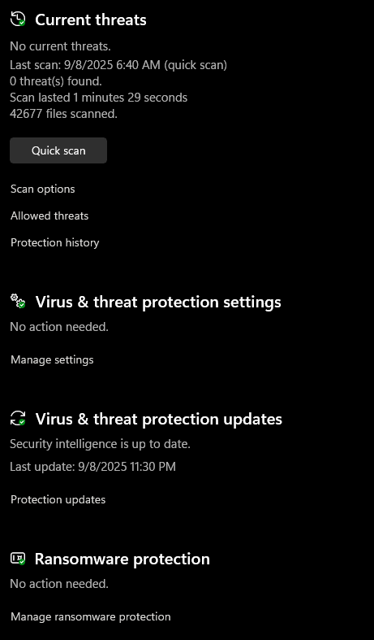

# Exercise 2

Done by: Timur Zhaken - 140314246

---

## Task 1

Name                       CPU usage
System                     0.5%
Windows Audio Device Graph 0.4%
Task Manager               0.4%
Spotify (8)                0.4%
HyperX NGENUITY (2)        0.2%

## Task 2

Google 999.5 MB

In use(Compressed) Memomry
9.5GB(73.3MB)

Available Memory 6.1GB

## Task 3

Monday, ‎September ‎8, ‎2025, ‏‎11:33:34 PM

## Task 4

Cameras USB2.0 HD UVC WebCam
Monitor DellU3423WE(HDMI1 2.1)
Keyboards StandardPS/2 Keyboard

Driver Files
USB2.0 HD UVC WebCam

C:\WINDOWS\system32\drivers\ksthunk.sys
C:\WINDOWS\system32\DRIVERS\UMDF\SecureUSBVideo.dll
C:\WINDOWS\system32\DRIVERS \usbvideo.sys
C:\WINDOWS\system32\drivers\WdmCompanionFilter.sys

Provider: Microsoft Corporation

File Version: 10.0.26100.4946 (WinBuild.160101.0800)

Copyright: Microsoft Corporation. All rights reserved.

Digital Signer: Microsoft Windows

Catalog File: Microsoft Windows supplied

## Task 5

## Challenge Questions:

### Which process is using the most resources and why might that be?

Usually the process that is using the most resources is the one that is currently running.

### What would happen if your OS didn't manage memory automatically?

Stack overflow, buffer overflow, data corruption, crashes and etc.

### How does your OS protect you from security threats?

The OS protects you from security threats by isolating processes, enforcing permissions, controlling access to resources, and using defenses like firewalls, encryption, and memory protection to block security threats.

