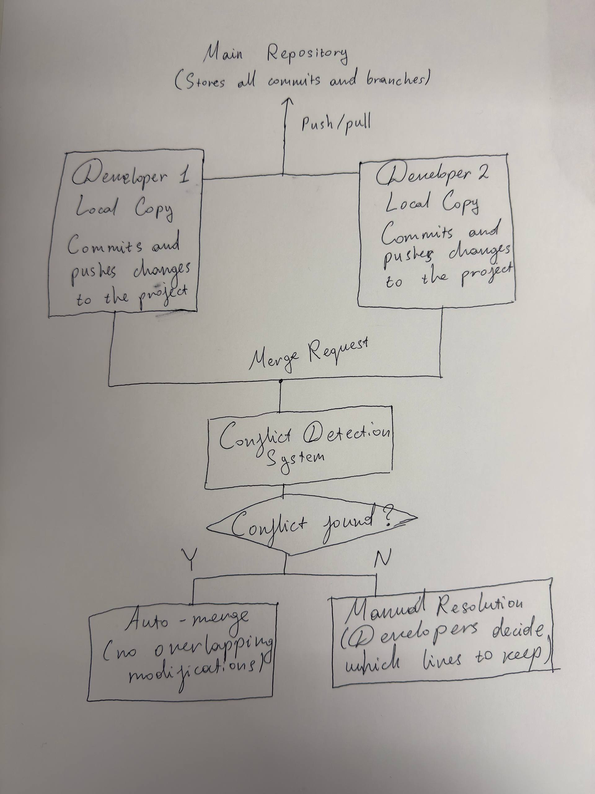
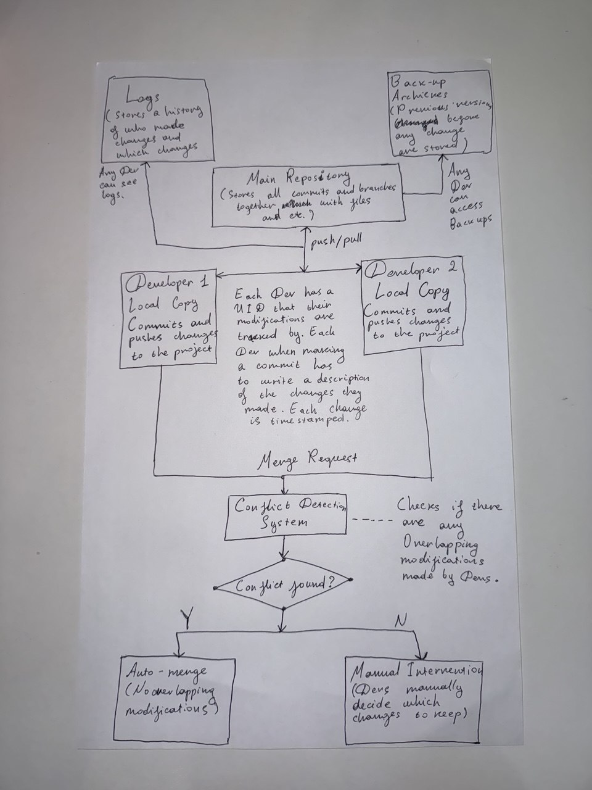

# System Design Challenge

Done by Timur Zhaken
Student ID: 140314246

## Part B: System Design Challenge

### Problem Analysis

#### i) Discuss what problems you encountered in Part A:

Since there was no communication it was hard to edit the file and see your changes kept in the final poem since a short while after pushing the changes you would see the changes overwritten.

#### ii) Were changes overwritten or lost?

Some lines of the poem were gone and overwritten during the chaos due to absence of communication.

#### iii) How did you decide which changes to keep?

The way we decided which changes to keep and which ones to leave out was by mutual agreement

#### iv) What if you had 5 people instead of 2?

In the situation of having a bigger team I think there might be even more chaos and it will be way harder to decide which modifications to keep in the final versions and which to get rid of.

#### v) How would you track who made which changes?

The ideal way of keeping track who made which changes would be by writing comments next to the changes or by tracking who was last to commit a change to the file.

### Solution Design

#### Diagram of a proper version control system

*Store Versions:* Commit objects store the info about the developers and the changes they have made.

*Track Who Made Changes:* Author info + timestamp inside each commit.

*Handle Conflicts:* System detects line-level conflicts and requires resolution.

*Name/Identify Versions:* Unique ID + optional tags.

*Describe Changes:* In the process of making a change github usually asks for a name for the changes and a description to be written.

*Prevent Overwriting:* Conflict Detection System will check both changes and compare and search for similarities between the two modifications.

## Part C: Document Your Solution

#### Version Control System on paper with Descriptions

#### 3 Problems for Part A that the System solves

1) No overwriting changes

2) Deleted changes are saved

3) Changes are documented

#### Wrap Up Quesion...

#### What was the most frustrating part of the collaboration chaos?

The absence of communication

#### Which problem from Part A does your system design solve best?

Every problem

#### What would happen if 10 people tried to collaborate this way?

If they collaborate with chaos it will be very messy but if they use an improved version control system they should have no issues at all

#### How does your design handle someone accidentally deleting the file?

It uses a back-up archieving system to save previous versions.

